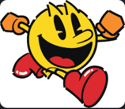

# PACMEN-EXCERCISE

En este ejercicio se trabajo en la animacion del personaje de videojuego Pac Man moviendose a traves de la pantalla, la animacion consiste en que el Pac Man vaya abriendo y cerrando la boca durante el movimiento y que una vez llegando al limite o borde de la pantalla el mismo de media vuelta y continue el movimiento indefinido.
